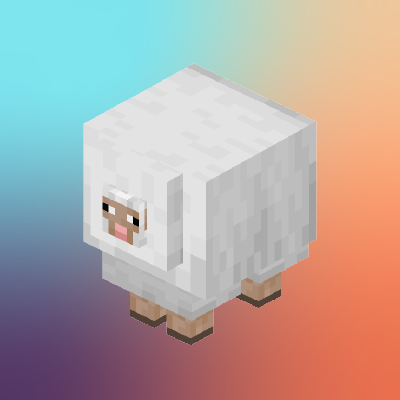
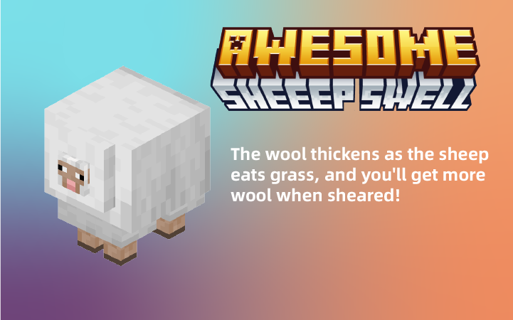
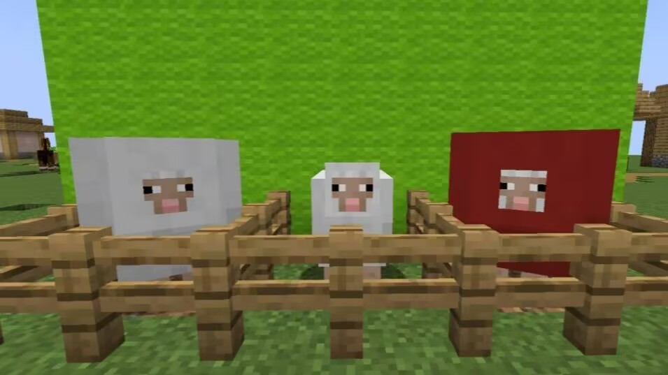

# Awesome Sheep Swell

This mod has improved the sheep's wool, which is very useful and fun. The wool thickens as the sheep eats grass, and
you'll get more wool when sheared!

## 📖 What's this mod?

Awesome Sheep Swell (ASS) is the unofficial Architectury port
of [Chonky Sheep](https://github.com/suppergerrie2/ChonkySheep), now available for Fabric and Forge.

This mod has improved the sheep's wool, which is very useful and fun. The wool thickens as the sheep eats grass, and
you'll get more wool when sheared!

This mod adds a new NBT `thickness` to sheep, which you can summon with a thickness of 20
via `/summon minecraft:sheep ~ ~ ~ {thickness:20}`.

## ✅ Features                                                                                                                                                                                                                       

- The wool thickness increases as the sheep eats grass.
- Shearing sheep yields extra wool, calculated as 0-2 additional wool based on the sheep's wool thickness.
- Configurable maximum wool thickness.
- Sheep spawn with a random thickness from 1 to 10, with decreasing weight as thickness increases.

## 📦 Compatibility

This mod reimplements the rendering method for sheep, so some effects from other mods that modify sheep
via Mixin might not be displayed as intended. Instead, they will be overridden by this mod, but it will
not cause any crashes.

Mods known to have their effects overridden by this mod: [Sheep Consistency (Forge)](https://www.curseforge.com/minecraft/mc-mods/sheep-consistency-forge) and [Sheep Consistency](https://www.curseforge.com/minecraft/mc-mods/sheep-consistency)

## ✨ Screenshots

## 👀 License

This mod is licensed under the [GPL3 license](LICENSE.md).

**Credits**: Original author [suppergerrie2](https://github.com/suppergerrie2/).
